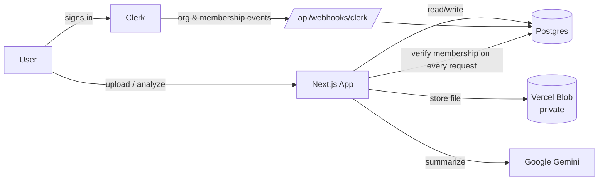

# DocAI

AI-powered document analysis for teams — upload documents into an
organization workspace and get instant summaries, sentiment, entity
extraction and Q&A from Google Gemini.

[](https://github.com/AmarKajevic/Multi-Tenant-AI-Document-Analysis/actions/workflows/ci.yml)

<!--
  Add a screenshot or short screen-recording GIF of the upload -> analyze
  flow here before sharing this README — a picture of the actual product
  sells it far better than the description below. A free screen recorder
  (ScreenToGif, Kap, LICEcap) is enough; ~10-15s of: open Documents page ->
  upload a file -> click Analyze -> summary appears is plenty.

  
-->

## What this is

A multi-tenant SaaS: each **organization** is an isolated workspace with its
own members, documents and usage quota. Membership and roles live in
[Clerk](https://clerk.com) (auth + organizations) and are mirrored into
Postgres via webhook, which is what every API route authorizes against.

**Live demo:** _add your Vercel URL here once deployed (see
[Deployment](#deployment))._

## Features

- **Organizations** — create/switch workspaces, invite teammates, per-org
  roles (owner/member) enforced server-side, not just in the UI
- **Document upload** — text, PDF, Word, Markdown, stored in a private
  Vercel Blob store (never publicly reachable by URL — served through an
  authenticated proxy route)
- **AI analysis** — summary, Q&A, sentiment, entity extraction, structured
  extraction, via Gemini
- **Usage limits** — each org gets a monthly document/analysis quota,
  enforced server-side with a live usage indicator in the UI (see
  [Usage limits](#usage-limits))
- **Clerk ⇄ Postgres sync** — a Clerk webhook keeps organizations,
  memberships and users in sync automatically (invited members, removed
  members, deleted accounts) — the DB is never the source of truth for who's
  in an org, Clerk is

## Tech stack

| Layer | Choice |
|---|---|
| Framework | Next.js 16 (App Router, Turbopack) |
| Auth & orgs | Clerk (organizations, webhooks) |
| Database | Postgres + Prisma ORM (driver adapter) |
| File storage | Vercel Blob (private access) |
| AI | Google Gemini (`@google/genai`) |
| UI | Tailwind CSS, shadcn-style components on Base UI |
| Testing | Vitest (unit), Playwright (E2E) |
| CI | GitHub Actions |

## Architecture



Every API route re-checks membership against Postgres (kept fresh by the
webhook) before touching any document — nothing trusts a client-supplied
organization ID or role.

## Getting started

```bash
git clone https://github.com/AmarKajevic/Multi-Tenant-AI-Document-Analysis.git
cd Multi-Tenant-AI-Document-Analysis
npm install
```

Create `.env` with:

| Variable | Purpose |
|---|---|
| `DATABASE_URL` | Postgres connection string |
| `NEXT_PUBLIC_CLERK_PUBLISHABLE_KEY` | Clerk frontend key |
| `CLERK_SECRET_KEY` | Clerk backend key |
| `NEXT_PUBLIC_CLERK_SIGN_IN_URL` | `/sign-in` |
| `NEXT_PUBLIC_CLERK_SIGN_UP_URL` | `/sign-up` |
| `CLERK_WEBHOOK_SIGNING_SECRET` | From Clerk Dashboard → Webhooks (see below) |
| `BLOB_READ_WRITE_TOKEN` | Vercel Blob store token |
| `GEMINI_API_KEY` | Google AI Studio API key |

Then:

```bash
npx prisma migrate dev   # creates tables (also runs on postinstall via generate)
npm run dev              # http://localhost:3000
```

### Wiring up the Clerk webhook

The app mirrors organizations/members/users from Clerk into Postgres — this
is what keeps access control correct when someone's invited or removed. In
the [Clerk Dashboard](https://dashboard.clerk.com) → **Webhooks**, add an
endpoint pointing at `/api/webhooks/clerk` (needs a public URL — use the
[Clerk CLI](https://clerk.com/docs/development/clerk-cli) or `ngrok` for
local dev) subscribed to: `user.created`, `user.updated`, `user.deleted`,
`organization.created`, `organization.updated`, `organization.deleted`,
`organizationMembership.created`, `organizationMembership.updated`,
`organizationMembership.deleted`. Copy the signing secret into
`CLERK_WEBHOOK_SIGNING_SECRET`.

## Usage limits

Each organization is on a `free` plan (see `lib/plans.ts`) with a monthly
document-upload and AI-analysis quota, enforced in `/api/documents` and
`/api/analyze` (`lib/usage.ts`) and surfaced as a live progress bar on the
org dashboard and documents page. There's no billing provider wired up —
`Organization.planTier` exists specifically so a future Stripe (or similar)
webhook only has to flip that one field, without touching any enforcement
logic.

## Testing

```bash
npm run test        # unit tests (Vitest) — pure logic, no DB/network
npm run test:e2e     # E2E (Playwright) — builds and boots the real app
```

The E2E suite currently covers the marketing page and the route guards
(signed-out visitors get redirected correctly) without needing test
credentials. See [`e2e/README.md`](./e2e/README.md) for how the full
sign-up → upload → analyze flow can be added with `@clerk/testing`.

CI (`.github/workflows/ci.yml`) runs typecheck, lint and unit tests on every
push/PR with no configuration needed. The E2E job additionally needs the same
variables from `.env` above added as **repository secrets** (Settings →
Secrets and variables → Actions) — it's skipped, not failed, until they're
present.

## Deployment

1. Push this repo to GitHub (already done if you're reading this on GitHub).
2. [Import it on Vercel](https://vercel.com/new) — no build config needed,
   Vercel detects Next.js automatically.
3. Add every variable from the [Getting started](#getting-started) table as
   a Vercel **Environment Variable** (Project Settings → Environment
   Variables) — use a separate Postgres/Blob/Clerk instance from local dev if
   you want clean prod data.
4. Add the deployed URL's `/api/webhooks/clerk` as the Clerk webhook endpoint
   (see above) instead of a local tunnel.
5. Deploy. Then run `npx prisma migrate deploy` against the production
   `DATABASE_URL` (from your machine, or a Vercel deploy hook) to create the
   tables.

## Project structure

```
app/
  (auth)/              # Clerk sign-in / sign-up
  (dashboard)/          # authenticated app shell
    select-org/          # org picker / creator
    [orgSlug]/            # org dashboard + documents, membership-gated
  api/
    organizations/        # org creation, verified against Clerk (not client input)
    documents/             # upload, list, delete, download (private blob proxy)
    analyze/                # Gemini analysis, quota-enforced
    webhooks/clerk/          # Clerk -> Postgres sync
components/
  document/              # upload dialog, document card, usage indicator
  ui/                    # shadcn-style primitives (Base UI)
lib/
  prisma.ts             # singleton Prisma client
  usage.ts / plans.ts    # quota enforcement
  blob.ts                # private Vercel Blob upload/download
  gemini.ts              # AI analysis prompts
prisma/schema.prisma    # Organization, User, OrganizationMember, Document, AnalysisRun
e2e/                     # Playwright tests
```

## License

Not yet licensed — all rights reserved by default. Add a `LICENSE` file
(MIT is a common choice for a portfolio project) if you want others to be
able to reuse the code.
